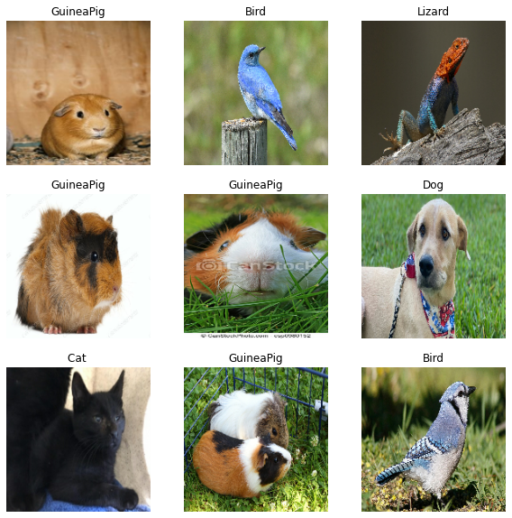
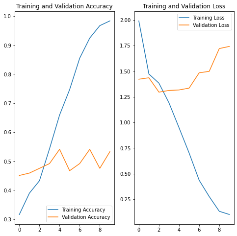

# Guinea Pig Image Classifier


```python
import matplotlib.pyplot as plt
import numpy as np
import os
import PIL
import tensorflow as tf
import pathlib

from tensorflow import keras
from tensorflow.keras import layers
from tensorflow.keras.models import Sequential

```


```python
data_dir = pathlib.Path('Animals/')
image_count = len(list(data_dir.glob('*/*.jpg')))
print(image_count)
```

    551


```python
guineas = list(data_dir.glob('GuineaPig/*'))
PIL.Image.open(str(guineas[0]))
print(len(guineas))
#PIL.Image.open(str(guineas[1]))

```

    259


```python
batch_size = 32
img_height = 180
img_width = 180

train_ds = tf.keras.utils.image_dataset_from_directory(
data_dir,
validation_split=0.2,
subset="training",
seed=123,
image_size=(img_height, img_width),
batch_size=batch_size)
```

    Found 612 files belonging to 5 classes.
    Using 490 files for training.


```python
val_ds = tf.keras.utils.image_dataset_from_directory(
data_dir,
validation_split=0.2,
subset="validation",
seed=123,
image_size=(img_height, img_width),
batch_size=batch_size)
```

    Found 612 files belonging to 5 classes.
    Using 122 files for validation.


```python
class_names = train_ds.class_names
print(class_names)
```

    ['Bird', 'Cat ', 'Dog', 'GuineaPig', 'Lizard']


## Visualizing Data


```python
import matplotlib.pyplot as plt

plt.figure(figsize=(10,10))
for images, labels in train_ds.take(1):
    for i in range(9):
        ax = plt.subplot(3, 3, i+1)
        plt.imshow(images[i].numpy().astype("uint8"))
        plt.title(class_names[labels[i]])
        plt.axis("off")
```


    

    


## Configuring/Standardizing Data


```python
AUTOTUNE = tf.data.AUTOTUNE

train_ds = train_ds.cache().shuffle(1000).prefetch(buffer_size=AUTOTUNE)
val_ds = val_ds.cache().prefetch(buffer_size=AUTOTUNE)

normalization_layer = layers.Rescaling(1./255)

normalized_ds = train_ds.map(lambda x, y: (normalization_layer(x), y))
image_batch, labels_batch = next(iter(normalized_ds))
first_image = image_batch[0]
print(np.min(first_image), np.max(first_image))
```

    0.0 1.0


## Model


```python
num_classes = len(class_names)

model = Sequential([
  layers.Rescaling(1./255, input_shape=(img_height, img_width, 3)),
  layers.Conv2D(16, 3, padding='same', activation='relu'),
  layers.MaxPooling2D(),
  layers.Conv2D(32, 3, padding='same', activation='relu'),
  layers.MaxPooling2D(),
  layers.Conv2D(64, 3, padding='same', activation='relu'),
  layers.MaxPooling2D(),
  layers.Flatten(),
  layers.Dense(128, activation='relu'),
  layers.Dense(num_classes)
])

model.compile(optimizer='adam',
              loss=tf.keras.losses.SparseCategoricalCrossentropy(from_logits=True),
              metrics=['accuracy'])

model.summary()
```

    Model: "sequential"
    _________________________________________________________________
     Layer (type)                Output Shape              Param #   
    =================================================================
     rescaling_1 (Rescaling)     (None, 180, 180, 3)       0         
                                                                     
     conv2d (Conv2D)             (None, 180, 180, 16)      448       
                                                                     
     max_pooling2d (MaxPooling2D  (None, 90, 90, 16)       0         
     )                                                               
                                                                     
     conv2d_1 (Conv2D)           (None, 90, 90, 32)        4640      
                                                                     
     max_pooling2d_1 (MaxPooling  (None, 45, 45, 32)       0         
     2D)                                                             
                                                                     
     conv2d_2 (Conv2D)           (None, 45, 45, 64)        18496     
                                                                     
     max_pooling2d_2 (MaxPooling  (None, 22, 22, 64)       0         
     2D)                                                             
                                                                     
     flatten (Flatten)           (None, 30976)             0         
                                                                     
     dense (Dense)               (None, 128)               3965056   
                                                                     
     dense_1 (Dense)             (None, 5)                 645       
                                                                     
    =================================================================
    Total params: 3,989,285
    Trainable params: 3,989,285
    Non-trainable params: 0
    _________________________________________________________________


## Training Model


```python
epochs=10
history = model.fit(
  train_ds,
  validation_data=val_ds,
  epochs=epochs
)


```

    Epoch 1/10
    16/16 [==============================] - 8s 435ms/step - loss: 1.6182 - accuracy: 0.3653 - val_loss: 1.3965 - val_accuracy: 0.4508
    Epoch 2/10
    16/16 [==============================] - 6s 347ms/step - loss: 1.4435 - accuracy: 0.4265 - val_loss: 1.3098 - val_accuracy: 0.5000
    Epoch 3/10
    16/16 [==============================] - 6s 354ms/step - loss: 1.3041 - accuracy: 0.4837 - val_loss: 1.3062 - val_accuracy: 0.4590
    Epoch 4/10
    16/16 [==============================] - 6s 368ms/step - loss: 1.0970 - accuracy: 0.5776 - val_loss: 1.3540 - val_accuracy: 0.4508
    Epoch 5/10
    16/16 [==============================] - 6s 381ms/step - loss: 0.8700 - accuracy: 0.6939 - val_loss: 1.3540 - val_accuracy: 0.5082
    Epoch 6/10
    16/16 [==============================] - 6s 390ms/step - loss: 0.6162 - accuracy: 0.7735 - val_loss: 1.5016 - val_accuracy: 0.4754
    Epoch 7/10
    16/16 [==============================] - 6s 405ms/step - loss: 0.3890 - accuracy: 0.8776 - val_loss: 1.6615 - val_accuracy: 0.4590
    Epoch 8/10
    13/16 [=======================>......] - ETA: 1s - loss: 0.2438 - accuracy: 0.9264


```python
acc = history.history['accuracy']
val_acc = history.history['val_accuracy']

loss = history.history['loss']
val_loss = history.history['val_loss']

epochs_range = range(epochs)

plt.figure(figsize=(8, 8))
plt.subplot(1, 2, 1)
plt.plot(epochs_range, acc, label='Training Accuracy')
plt.plot(epochs_range, val_acc, label='Validation Accuracy')
plt.legend(loc='lower right')
plt.title('Training and Validation Accuracy')

plt.subplot(1, 2, 2)
plt.plot(epochs_range, loss, label='Training Loss')
plt.plot(epochs_range, val_loss, label='Validation Loss')
plt.legend(loc='upper right')
plt.title('Training and Validation Loss')
plt.show()

```


    

    


## Data Augmentation and Drop Out Technique

This is done to improve accuracy due to low data set size


```python
if(acc[9] >= 0.9):
    print("No Need to do as model is >= 0.9")
else:
    data_augmentation = keras.Sequential(
      [
    layers.RandomFlip("horizontal",
                      input_shape=(img_height,
                                  img_width,
                                  3)),
    layers.RandomRotation(0.1),
    layers.RandomZoom(0.1),
      ]
    )

    model = Sequential([
  data_augmentation,
  layers.Rescaling(1./255),
  layers.Conv2D(16, 3, padding='same', activation='relu'),
  layers.MaxPooling2D(),
  layers.Conv2D(32, 3, padding='same', activation='relu'),
  layers.MaxPooling2D(),
  layers.Conv2D(64, 3, padding='same', activation='relu'),
  layers.MaxPooling2D(),
  layers.Dropout(0.2),
  layers.Flatten(),
  layers.Dense(128, activation='relu'),
  layers.Dense(num_classes)
    ])
```

    No Need to do as model is >= 0.9


```python
if(acc[9] >= 0.9):
    print("No Need to do as model is >= 0.9")
else:
    model.compile(optimizer='adam',
              loss=tf.keras.losses.SparseCategoricalCrossentropy(from_logits=True),
              metrics=['accuracy'])

    model.summary()
```

    No Need to do as model is >= 0.9


```python
if(acc[9] >= 0.9):
    print("No Need to do as model is >= 0.9")
else:
    epochs = 15
    history = model.fit(
  train_ds,
  validation_data=val_ds,
  epochs=epochs
    )
```

    No Need to do as model is >= 0.9


```python
if(acc[9] >= 0.9):
    print("No Need to do as model is >= 0.9")
else:
    acc = history.history['accuracy']
    val_acc = history.history['val_accuracy']

    loss = history.history['loss']
    val_loss = history.history['val_loss']

    epochs_range = range(epochs)

    plt.figure(figsize=(8, 8))
    plt.subplot(1, 2, 1)
    plt.plot(epochs_range, acc, label='Training Accuracy')
    plt.plot(epochs_range, val_acc, label='Validation Accuracy')
    plt.legend(loc='lower right')
    plt.title('Training and Validation Accuracy')

    plt.subplot(1, 2, 2)
    plt.plot(epochs_range, loss, label='Training Loss')
    plt.plot(epochs_range, val_loss, label='Validation Loss')
    plt.legend(loc='upper right')
    plt.title('Training and Validation Loss')
    plt.show()
```

    No Need to do as model is >= 0.9


## Predict


```python
path = 'Tests/Cinnamon/c1.jpg'

pil_im = PIL.Image.open(path)

display(pil_im)


img = tf.keras.utils.load_img(
    path, target_size=(img_height, img_width)
)
img_array = tf.keras.utils.img_to_array(img)
img_array = tf.expand_dims(img_array, 0) # Create a batch

predictions = model.predict(img_array)
score = tf.nn.softmax(predictions[0])

print(
    "This image most likely belongs to {} with a {:.2f} percent confidence."
    .format(class_names[np.argmax(score)], 100 * np.max(score))
)

```


    

    


    This image most likely belongs to GuineaPig with a 77.38 percent confidence.


```python
path = 'Tests/Cinnamon/c2.jpg'

pil_im = PIL.Image.open(path)

display(pil_im)


img = tf.keras.utils.load_img(
    path, target_size=(img_height, img_width)
)
img_array = tf.keras.utils.img_to_array(img)
img_array = tf.expand_dims(img_array, 0) # Create a batch

predictions = model.predict(img_array)
score = tf.nn.softmax(predictions[0])

print(
    "This image most likely belongs to {} with a {:.2f} percent confidence."
    .format(class_names[np.argmax(score)], 100 * np.max(score))
)

```


    

    


    This image most likely belongs to GuineaPig with a 90.41 percent confidence.


```python
path = 'Tests/Cinnamon/c3.jpg'

pil_im = PIL.Image.open(path)

display(pil_im)


img = tf.keras.utils.load_img(
    path, target_size=(img_height, img_width)
)
img_array = tf.keras.utils.img_to_array(img)
img_array = tf.expand_dims(img_array, 0) # Create a batch

predictions = model.predict(img_array)
score = tf.nn.softmax(predictions[0])

print(
    "This image most likely belongs to {} with a {:.2f} percent confidence."
    .format(class_names[np.argmax(score)], 100 * np.max(score))
)

```


    

    


    This image most likely belongs to Lizard with a 42.26 percent confidence.


```python
path = 'Tests/Cinnamon/c4.jpg'

pil_im = PIL.Image.open(path)

display(pil_im)


img = tf.keras.utils.load_img(
    path, target_size=(img_height, img_width)
)
img_array = tf.keras.utils.img_to_array(img)
img_array = tf.expand_dims(img_array, 0) # Create a batch

predictions = model.predict(img_array)
score = tf.nn.softmax(predictions[0])

print(
    "This image most likely belongs to {} with a {:.2f} percent confidence."
    .format(class_names[np.argmax(score)], 100 * np.max(score))
)

```


    

    


    This image most likely belongs to Lizard with a 61.71 percent confidence.


```python
path = 'Tests/Cinnamon/c5.jpg'

pil_im = PIL.Image.open(path)

display(pil_im)


img = tf.keras.utils.load_img(
    path, target_size=(img_height, img_width)
)
img_array = tf.keras.utils.img_to_array(img)
img_array = tf.expand_dims(img_array, 0) # Create a batch

predictions = model.predict(img_array)
score = tf.nn.softmax(predictions[0])

print(
    "This image most likely belongs to {} with a {:.2f} percent confidence."
    .format(class_names[np.argmax(score)], 100 * np.max(score))
)

```


    

    


    This image most likely belongs to Cat  with a 56.69 percent confidence.


```python

```
